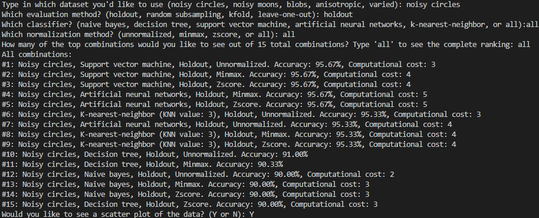
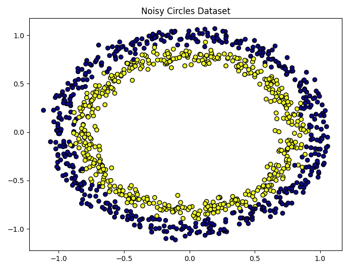
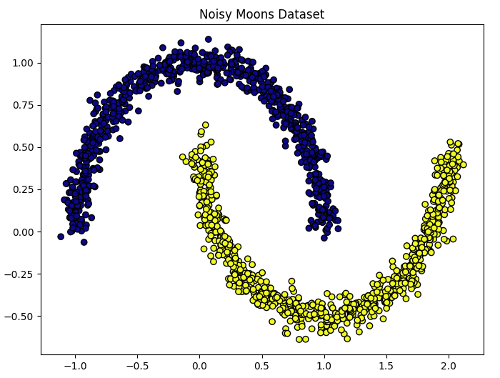
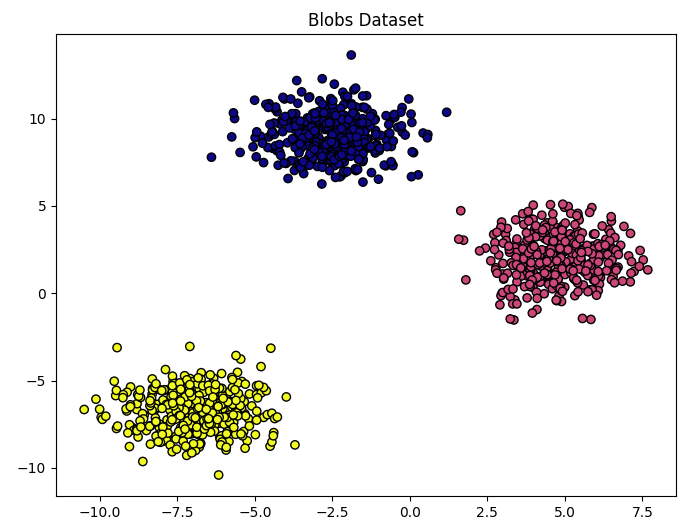
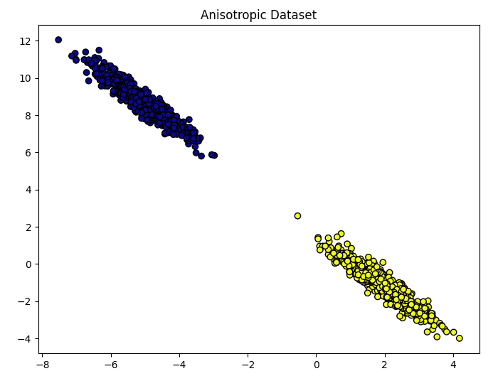
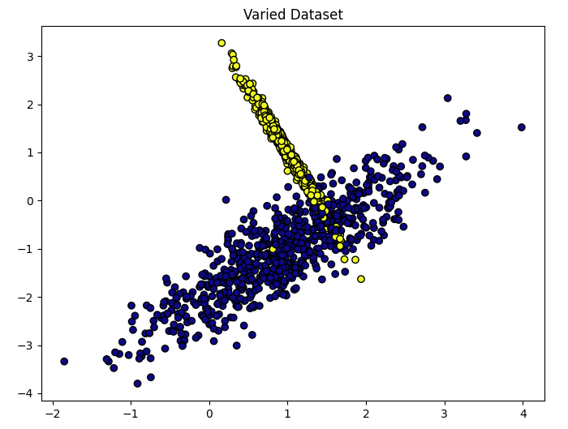

# Machine Learning Classifier Comparison

This project allows users to choose between dozens of combinations of classifiers, evaluation methods, and normalization techniques on specific datasets to compare performance. Combinations are ranked by accuracy, with computational cost used as a tiebreaker, and the user can visualize datasets with scatter plots.

This was originally a capstone project comparing these combinations manually. I then refactored it to let users interactively select combinations and automatically generate accuracy rankings.

## Datasets analyzed

Five datasets from sklearn:
- **Noisy circles**
- **Noisy moons**
- **Blobs**
- **Anisotropically distributed data**
- **Varied data**

## Programming language and modules used

- Python 3.14
- Scikit-learn
- Numpy
- Matplotlib

## Methods compared

**Classifiers**:
- Naive Bayes
- Decision tree
- Support vector machine (SVM)
- K-nearest neighbors (KNN) (k=3, 5, 7)
- Artificial neural networks (ANN)

**Evaluation methods**:
- Holdout (train/test split)
- Random subsampling
- Leave-one-out cross-validation
- K-fold cross-validation

**Normalization techniques**:
- Min-max normalization
- Z-score normalization  
- Unnormalized

## User selection and ranking


## Dataset plots







## Future Additions
- Connect backend to Flask frontend
- Deploy on Render
- Allow user to display top half or top quarter of ranked combinations

## Run Locally
```bash
# Clone repository
git clone https://github.com/kendomi0/ml-classifier-comparison.git
cd ml-classifier-comparison

# Install dependencies
pip install -r requirements.txt

# Run the main file to trigger user selection of combinations
python main.py
```
